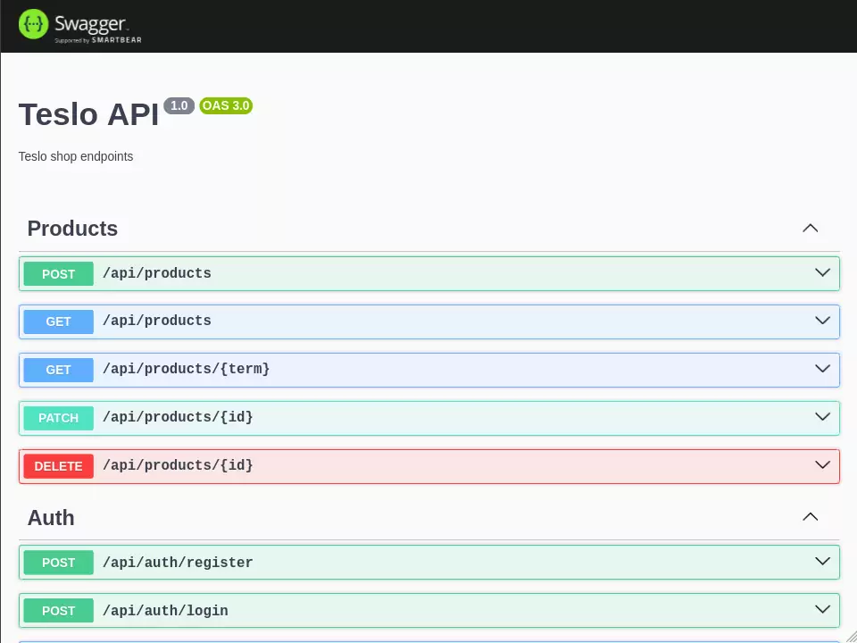

<p align="center">
  <a href="http://nestjs.com/" target="blank"></a>
</p>


# Teslo API

1. Clonar proyecto
2. Instalar las dependencias 
```
yarn install
```
3. Clonar el archivo ```.env.template``` y renombrarlo a ```.env```
4. Cambiar las variables de entorno
5. Levantar la base de datos
```
docker-compose up -d
```

6. Ejecutar SEED 
```
http://localhost:3001/api/seed
```

7. Levantar: ```yarn start:dev```


8. Ingresamos a la API
```
http://localhost:3001/api
```

